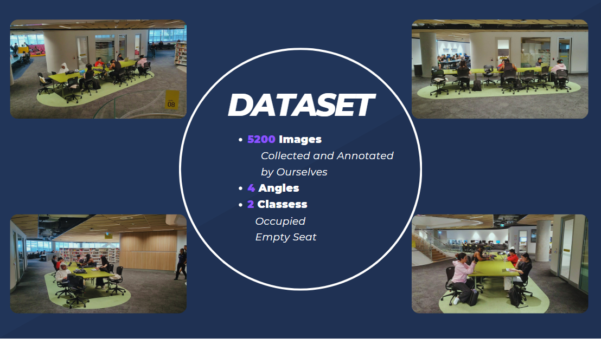
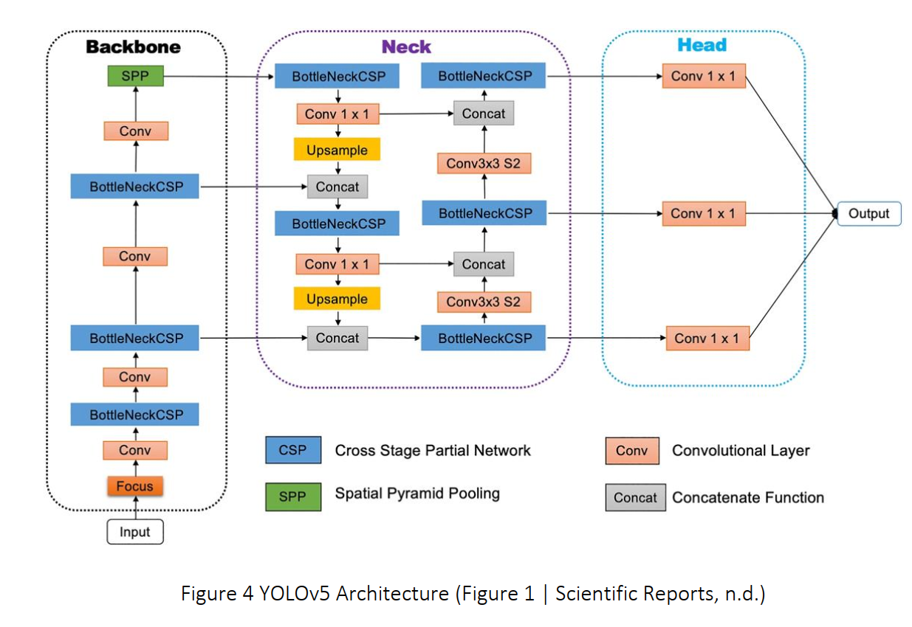
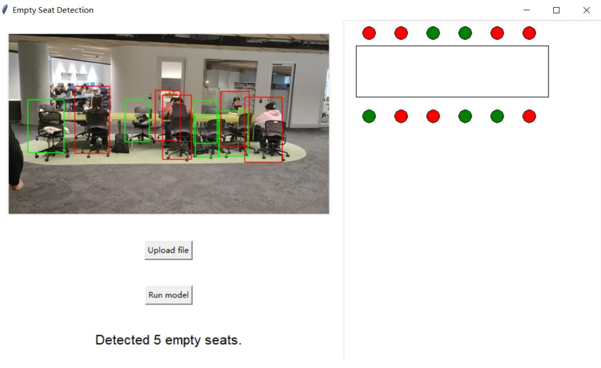

# Empty Seat Detection in UTS Library with YOLOv5

## Introduction

This project is about developing a real-time computer vision application to accurately detect and highlight empty seats within the UTS Library. The application utilizes deep learning techniques and a customized dataset for training the YOLOv5 machine learning model.

## Dataset

The dataset used in this project was manually created and labeled to ensure high-quality training data for the model. The dataset primarily comprises images of various seating arrangements and statuses within the UTS Library, which helped in accurate empty seat detection.

## Model

We are using Transfer Learning technique, and the current model architectures
have been pre-trained on "human" data. Therefore, in the initial performance testing phase,
we only trained and tested the model using the empty seat dataset.

Units in mAP@.50IoU
| CNN Architecture | Train Accuracy | Validation Accuracy | Test Accuracy |
| -------------- | -------------- | ---------- | --------- |
| Faster RCNN         | 0.984 | 0.967     | 0.969 |
| YOLOV6            | 0.959            | 0.957        | 0.965 |
| YOLOV5      | 0.994  | 0.994         | 0.994 |

Units in mAP@.50:95IoU
| CNN Architecture | Train Accuracy | Validation Accuracy | Test Accuracy |
| -------------- | -------------- | ---------- | --------- |
| Faster RCNN      | 0.755 | 0.748     | 0.750 |
| YOLOV6           | 0.735            | 0.730        | 0.749 |
| YOLOV5           | 0.927  | 0.842         | 0.843 |

RCNN (Region-based Convolutional Neural Network) is a two-stage object detection
algorithm that incorporates a Region Proposal Network (RPN) to generate candidate
bounding boxes for object detection. It follows a two-step process of generating region
proposals and then performing classification and localization on those proposals, which
enhances the accuracy of bounding box localization. However, this multi-stage process
sacrifices speed, making it less suitable for real-time monitoring applications.

YOLOv6 utilizes the EfficientRep backbone network and decoupled head. It is a single-stage
object detection model, meaning it can perform object localization and image classification
within the same network. According to research, it is capable of detecting smaller objects, but
compared to YOLOv5, it may suffer from flickering, struggle with close-range objects, and
lack stability (Goled, 2022). Based on the results of this study, it can be observed that
YOLOv6 may not be suitable for our specific scenario.

In summary, the YOLOv5 architecture demonstrated the best overall performance, and
therefore, it was chosen as the architecture for this experiment.

The model used in this project is YOLOv5. This model was chosen after comparing the performance of multiple models. YOLOv5 showed superior performance in terms of accuracy and speed, which made it a perfect fit for a real-time application like this.

### Architecture

Here is the architecture of the YOLOv5 model used in this project:

## Demo

Below is a demonstration of the application. The dynamic GUI designed as part of the project visualizes the location of empty seats on a library floor plan.

---

Thank you for checking out this project! For more information or if you have any questions, please feel free to contact me.

Yiheng.liang-1@student.uts.edu.au
